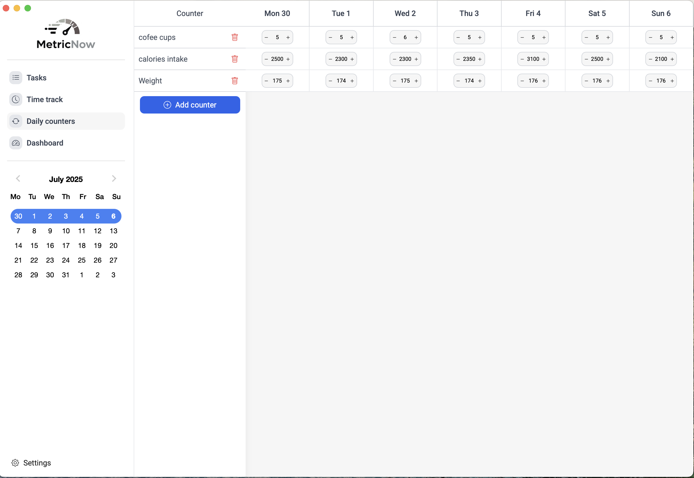
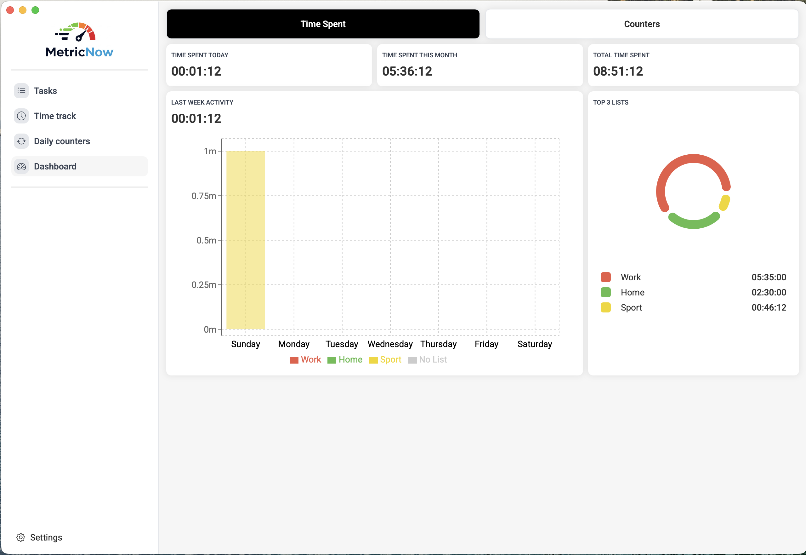
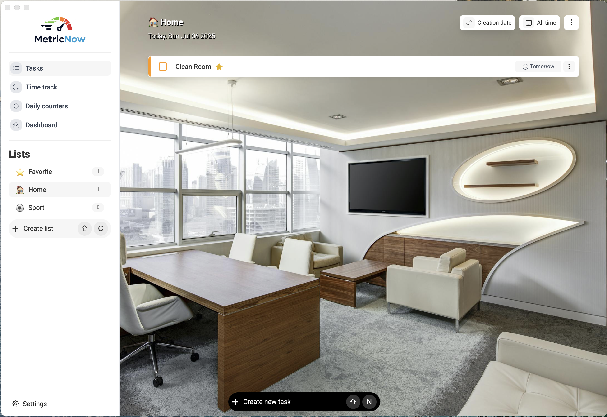
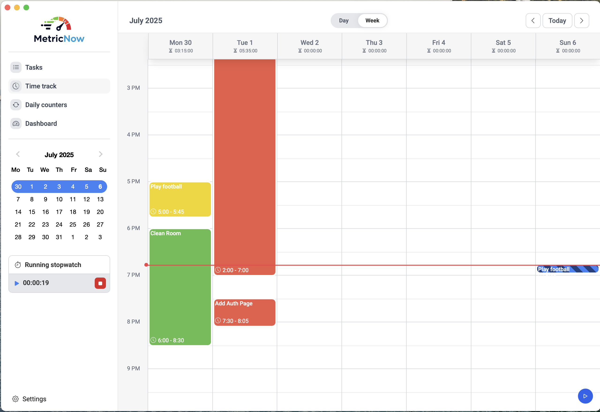
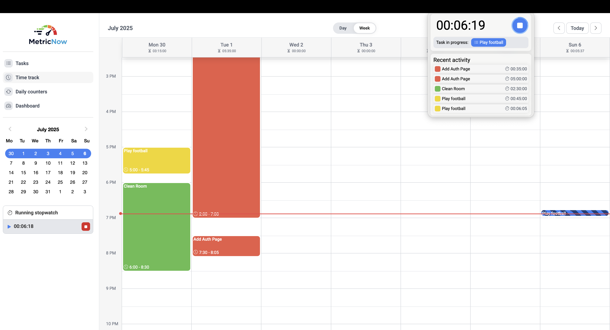

# 🕒 MetricsNow

**MetricsNow** is a minimal task-based time tracker built with simplicity and productivity in mind. It helps you incrementally track how much time you spend on various tasks using counters — no timers, no distractions.

---

## 📦 Tech Stack

| Layer      | Tech               |
| ---------- | ------------------ |
| Frontend   | React + TypeScript |
| Styling    | SCSS               |
| Backend    | Tauri (Rust)       |
| Database   | SQLite             |
| Forms      | TanStack Form      |
| Build Tool | pnpm + Vite        |

---

## 🚀 Features

- ⏱️ Task-based time counters
- 📊 Local persistence via SQLite
- 💻 Cross-platform desktop app (macOS, Windows, Linux)
- 🧩 Minimal UI built with React + SCSS
- 🎯 Typed forms powered by TanStack Form
- 🔒 Fully offline-capable

---

## 🛠️ Getting Started

### 1. Install dependencies

```bash
pnpm install
```

## ✨ Screenshots

### 📋 Counters



---

### 📊 Dashboard – Counters View


---

### 🧭 Dashboard – Overview



---

### ✅ Task Management



---

### ⏱️ Time Tracking



---

### 📌 Tray Integration


